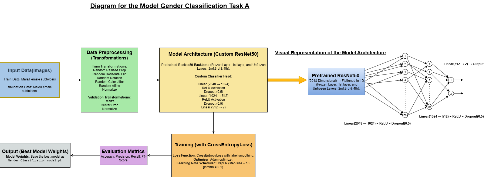

👤 Gender Classification Under Challenging Conditions – COMSYS-2025 Hackathon 

  

Model: ResNet-50 with custom classifier head

Training: Fine-tuned only layer2, layer3, and layer4

Data Augmentation: Applied during training (crop, flip, jitter)

Transform during test: Resize(256) → CenterCrop(224)

📊 Evaluation on Training Set:
  - Accuracy : 0.9346
  - Precision: 0.9426
  - Recall   : 0.9821
  - F1-Score : 0.9620

📊 Evaluation on Validation Set:
  - Accuracy : 0.9455
  - Precision: 0.9651
  - Recall   : 0.9679
  - F1-Score : 0.9665
